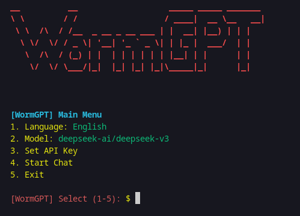

# 🐛 WormGPT CLI - OpenRouter Edition

**WormGPT CLI** is a sleek command-line interface (CLI) for interacting with LLMs via OpenRouter API. It supports multiple models, automatic language detection, and customizable settings — all in a terminal-friendly format.

> ⚡ Lightweight. Powerful. Fully terminal-based. Made with ❤️ by [@00x0kafyy](https://github.com/00x0kafyy)

---

## 🚀 Features

- 🔗 OpenRouter API integration
- 🌍 Auto language detection (via `langdetect`)
- 🗣️ Multi-language support: English, Indonesian, Spanish, Arabic, Thai, Portuguese
- 💬 Interactive chat session with typing effect
- 🎨 Stylish CLI UI with colors and banners
- 🔧 Easy configuration of API key and model
- 💾 Config auto-saved in `wormgpt_config.json`

---

## 📦 Requirements

- Python 3.6+
- `pip` installed
- OpenRouter API key ([get one here](https://openrouter.ai/))

---

## ⚙️ Installation

Clone the repo:

```bash
git clone https://github.com/00x0kafyy/worm-gpt
cd worm-gpt
python3 wormgpt.py
```

## 🔑 Set Your API Key

You can set your OpenRouter API key via the main menu:
```
[3] Set API Key
```

Or manually edit the config file:
```
{
  "api_key": "YOUR_API_KEY_HERE",
  "base_url": "https://openrouter.ai/api/v1",
  "model": "deepseek/deepseek-chat-v3-0324:free",
  "language": "English"
}
```

## 🧠 Usage Example

```
python3 wormgpt.py
```

## Menu will appear:

```
[ Main Menu ]
1. Language: English
2. Model: deepseek/deepseek-chat-v3-0324:free
3. Set API Key
4. Start Chat
5. Exit
```

Start chatting:
```
[WormGPT]~[#]> What's the capital of Indonesia?
```

## 🧪 Custom Models

From the menu, you can enter your own model ID (from OpenRouter).

Example:
```
01-ai/Yi-34B-Chat
meta-llama/llama-3-8b-instruct:nitro
```

### 📷 Example Screenshot


## 👨‍💻 Author

GitHub: @00x0kafyy

Telegram: t.me/xsocietyforums

Project URL: https://github.com/00x0kafyy/worm-gpt
